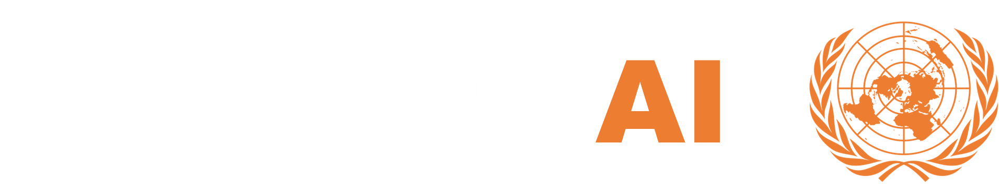

Helps you prepare for Model United Nations with AI.

[See this working](https://npsboy.github.io/delegate-ai/#/)

## Features:
- Gives you a brief overview of your delegation and its stance.
- Write a Position Paper.
- Draft speeches including GSL and Moderated Caucus.
- View allies and rivals.

## Limitations:
- Does not support committees like the "All India Political Parties Meet (AIPPM)" or local affairs in the "Joint Crisis Committee (JCC)".
- Supports only international affairs.

## What is MUN?
Model United Nations (MUN) is a simulation of the United Nations that teaches students about diplomacy, the workings of the United Nations, etc. During a MUN, delegates assume the roles of representatives of countries to collaborate and present global issues in "Committees" simulating the UN.

